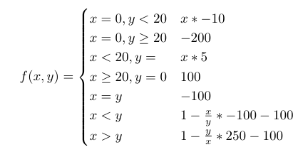

# Deterrence

This is a simple nuclear disarmament game created using the open source oTree python library. A live version of the game can be accessed on [Heroku](tree-game.herokuapp.com). 

The game consists of a series of rounds. In each round, both players in a group will choose to build or destroy from 0 to 15 nuclear warheads. 
Then, each player will decide if they want to start nuclear war. If either player begins nuclear war, or both players reach 0 nuclear warheads, the game ends and final scores are calculated.
Final payoffs are calculated according to this function, where _x_ is the nuke count of the player score is being calculated for and _y_ is the opponents nuke count:

Feel free to play with this or modify it however you would like. This was created for the Game Theory course at Abilene Christian University in the Spring of '19.
The report which describes the game is uploaded with this repo, and can be found [here](./report.pdf).
